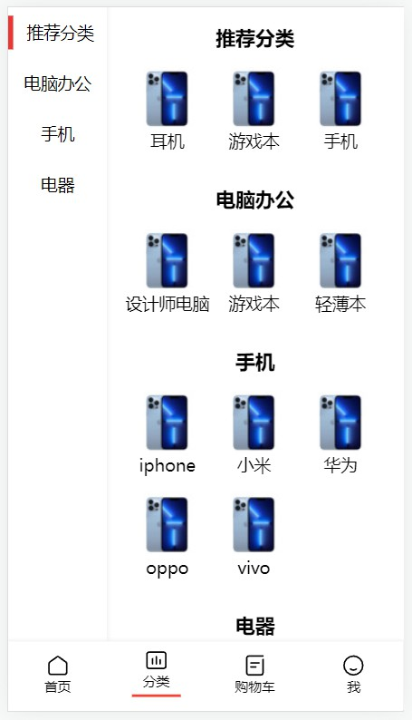
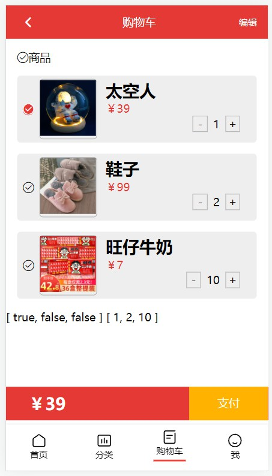
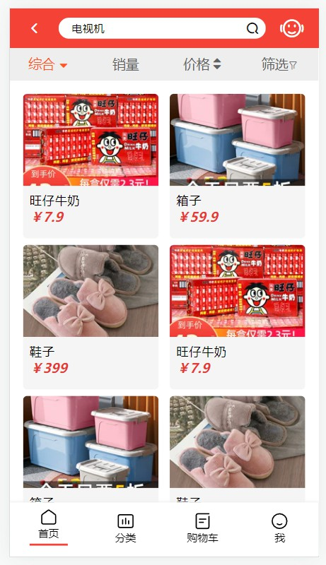

# vue3 购物网站
# 简介
一个简单的购物网站，包含首页展示，分类页面，商品详情页，购物车等页面
# 相关
* vue3 使用vue3.2组合式api
* 使用vue-router进行路由跳转
* 使用pinia替代vuex完成状态管理
* 使用keep-alive对详情页面进行缓存，避免组件的频繁创建和销毁
* 使用token进行登录认证
* 使用express-generator搭建了一个简易的后台
# 预览图

